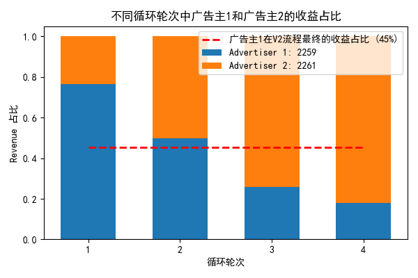
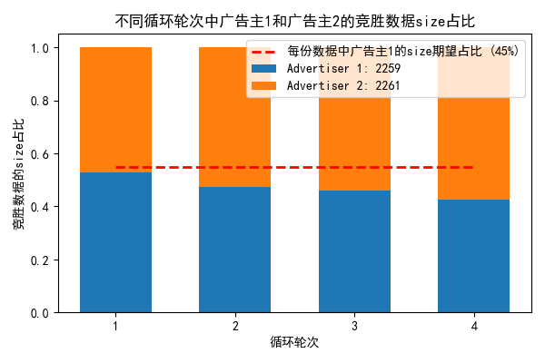

## 实验设置
- CTR模型

    采用 logistic regression：$ctr = sigmoid(w * x)$，负责所有流量（包括不同广告主）的CTR预估，所有广告主共用一个CTR模型

- bidding模型

    采用 Truthful Bidding：$bid\_price = ctr * camp\_v$，其中 $camp\_v$ 为训练数据集的 $ecpc = cost\_sum / clk\_sum$

    不同广告主的 $camp\_v$ 不同，使用不同的 bidding 模型

    Truthful Bidding 模型不用训练

- 模拟过程的 revenue 计算

    对竞胜流量来说，$revenue = y * camp\_v - market\_price$，y 为用户是否点击的真实标签

横向的不同流程设置：将所有数据 all.yzx.txt 等分为 n 份 (n = 5)
- V1：使用第一份训练，在第二份上模拟，竞胜的数据加入训练，再在第三份上模拟，竞胜的数据加入训练，一直持续到最后一份
- V2: 使用前 n-1 份所有数据训练，在最后一份上模拟
- V3：仅使用第一份训练，在最后一份上模拟

纵向的不同流程设置：
- 仅使用一个广告主的所有数据
- 同时使用两个广告主的所有数据

## 实验结果
### 预期
对于同时使用两个广告主所有数据，考察模拟结果中不同广告主的 revenue 在两个广告主总 revenue 中的占比，预期 V2 流程结果中两个广告主收益占比相差不大，表示两个广告主同等重要，但 V1 流程中，某个广告主获得的竞胜数据量占比较大，因此能得到较好的训练，使得收益占比变大，后续的竞胜数据量占比也随之增大，进而持续下去。
### 实际
A广告主id:2259，B广告主id:2261

### 其他
- 对于V2流程

    单2259广告主模拟收益为 1974444；单2261广告主模拟收益为 1948853；同时使用两个广告主数据之后模拟收益分别为 2488483 & 3013580

    加入其他广告主数据训练之后收益均有提升

- 对于V1流程：

    单2259广告主模拟收益为 1570557；单2261广告主模拟收益为 2192965；同时使用两个广告主数据之后模拟收益分别为 847592 & 3860563

    加入其他广告主数据训练之后，2259广告主收益下降，2261广告主收益增加，符合V1流程中模型对2261广告主注意力越来越高的现象

<!-- ## 问题
1. 数据占比变化波动较小，但收益占比变化波动较大
2. 不同份模拟中收益有很大的不同，例如第2份收益有500多w，但其余收益没有这么高
3. AUC指标与收益指标并不同步，例如V2流程最后模拟结果中： 2259 广告主 AUC指标有 0.58、2261广告主则为0.51；但 2259 广告主收益为 917843，远低于 2261 广告主的收益 3360421，AUC指标高不代表收益高？或者说这仅针对单个广告主生效，不同广告主收益池天然差距大
4. 要解决的问题：在不拉低总收益的前提下改变不同广告主收入占比差距越来越大的现象 -->