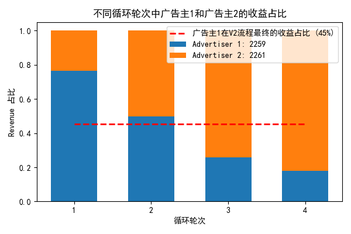

实验效果

广告主2竞胜样本多(收入多)，得到更好的训练，能够在下一轮迭代中得到更多的竞胜样本(更大的收入)，一直扩大优势，尽管用前 n-1 份所有数据得到的结果是两个广告主同等重要。

## 

另外的现象：在最好的训练轮次中，CTR模型的AUC指标高的广告主点击率，竞胜率，收入都低于另一个广告主,例如以下数据([4]2259-2261V1)：

<!-- 19    250550   242.91155555555557   43.680835972387335   0.00017982197624351892  847592   100099   18       0.5850469876487588   0.018198095773693645 0.19385016219895307  4372408 
19    206295   177.4540294117647    44.45568752855185    0.0002505194594674251   3860563  135718   34       0.5125964863039628   0.016028489220094113 0.6398613261396447   6033437  -->

## 
解释1：
<!-- Click-through rate prediction in online advertising: A literature review 中的 24 页 -->
> Meanwhile, a model may not perform better in terms of all evaluation metrics, even on a same dataset. In other words, a model with a higher AUC value may not necessarily have a smaller Logloss than others (Liu et al., 2019; Huang et al., 2019). In addition, a model may favor some data characteristics that are different across datasets, thus perform differently on different datasets.

论文地址：AUC: a misleading measure of the performance of predictive distribution models

当类不均衡时（正类样本少，负类样本多），模型预测更多的假阳性会得到更高的AUC值，这导致未点击样本预测点击概率提高，进而导致实际不点击（不带来收益，只有成本）的竞胜样本增加，收入降低

## 
解释2:

当前 bidding 模型中，对于两个差距较大(相似性低)的样本而言(可以是同一个广告主或者不同广告主)，AUC指标高(模型估的准)不代表竞胜率高，也不代表收入高，原因是否在于 bidding 模型 bid_price=ctr∗camp_v 没有读取 winning_price 信息，只根据点击率的高低决定出价

建立 2*2 矩形，横轴为CTR高低，纵轴为 winning_price 高低，将流量特征分为4类，改变特征分布就可以在不变动AUC情况下改变竞胜率和收入

例如对于上述数据，这是相应样本差距，ecpm差距大

{'size': 250550, 'cost_sum': 26110916, 'clk_sum': 83, 'ecpm': 104.21439233685891, 'ecpc': 314, 'ctr': 0.00033127120335262424, 'max_price': 294}

{'size': 206295, 'cost_sum': 17217041, 'clk_sum': 53, 'ecpm': 83.45835332897065, 'ecpc': 324, 'ctr': 0.0002569136430839332, 'max_price': 294}

## 
解决方法：
1. bidding 模型引入 winning_price 信息，如何做到？
2. 控制两个广告主的样本具有高相似性，如样本总数一致，ecpm一致(即winning_price分布相似)，点击样本占比一致，但能否改变数据集？
3. 不采用 AUC 指标？

<!-- 竞胜样本比例越来越高，收入比例也越来越高，越训练表现越好的现象？ -->

<!-- 归结于竞胜样本多导致的收入高？
但不能说明为什么竞胜样本比例越来越高，收入比例也越来越高，这个趋势才是越估越准的现象 -->

<!-- 1th part: 
1th advertiser's data info:
Here are the statistics:
{'size': 250551, 'cost_sum': 21776380, 'clk_sum': 90, 'ecpm': 86.91396162857063, 'ecpc': 241, 'ctr': 0.0003592083048960092, 'max_price': 294}
2th advertiser's data info:
Here are the statistics:
{'size': 206296, 'cost_sum': 17295610, 'clk_sum': 53, 'ecpm': 83.83880443634389, 'ecpc': 326, 'ctr': 0.0002569123977197813, 'max_price': 294}

2th part: 
1th advertiser's data info:
Here are the statistics:
{'size': 250551, 'cost_sum': 22761493, 'clk_sum': 72, 'ecpm': 90.84574797147087, 'ecpc': 316, 'ctr': 0.00028736664391680735, 'max_price': 294}
2th advertiser's data info:
Here are the statistics:
{'size': 206296, 'cost_sum': 18909296, 'clk_sum': 57, 'ecpm': 91.66099197269942, 'ecpc': 331, 'ctr': 0.00027630201264202894, 'max_price': 294}

3th part: 
1th advertiser's data info:
Here are the statistics:
{'size': 250551, 'cost_sum': 24934474, 'clk_sum': 88, 'ecpm': 99.51855710015127, 'ecpc': 283, 'ctr': 0.00035122589812054233, 'max_price': 294}
2th advertiser's data info:
Here are the statistics:
{'size': 206296, 'cost_sum': 19498733, 'clk_sum': 83, 'ecpm': 94.51823108543064, 'ecpc': 234, 'ctr': 0.0004023345096366386, 'max_price': 294}

4th part: 
1th advertiser's data info:
Here are the statistics:
{'size': 250550, 'cost_sum': 25669192, 'clk_sum': 77, 'ecpm': 102.45137497505488, 'ecpc': 333, 'ctr': 0.00030732388744761526, 'max_price': 294}
2th advertiser's data info:
Here are the statistics:
{'size': 206296, 'cost_sum': 17486258, 'clk_sum': 58, 'ecpm': 84.76295226276807, 'ecpc': 301, 'ctr': 0.0002811494163725908, 'max_price': 294}

5th part:
1th advertiser's data info:
Here are the statistics:
{'size': 250550, 'cost_sum': 26110916, 'clk_sum': 83, 'ecpm': 104.21439233685891, 'ecpc': 314, 'ctr': 0.00033127120335262424, 'max_price': 294}
2th advertiser's data info:
Here are the statistics:
{'size': 206295, 'cost_sum': 17217041, 'clk_sum': 53, 'ecpm': 83.45835332897065, 'ecpc': 324, 'ctr': 0.0002569136430839332, 'max_price': 294} -->
